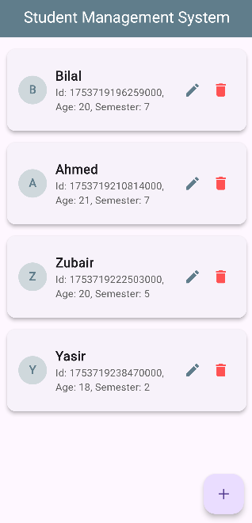
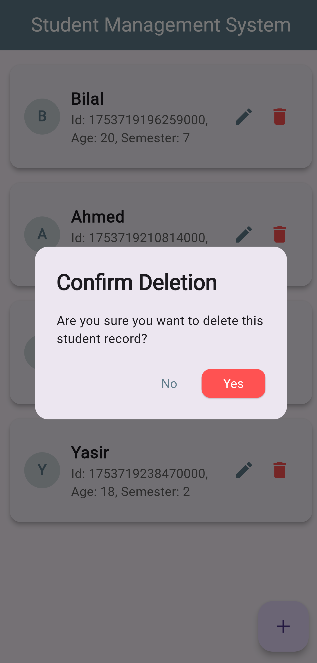

# Student Management App

This is a simple Flutter application for managing student records locally using Shared Preferences. It allows you to perform basic CRUD (Create, Read, Update, Delete) operations on student data with a clean, user-friendly interface.

## Features

* **Add New Students:** Easily add new student records with their name, age, and semester.
* **View Student List:** Displays all saved student records in a scrollable list.
* **Edit Student Details:** Modify existing student information directly from the list.
* **Delete Students:** Remove student records with a confirmation dialog.
* **Persistent Storage:** All student data is saved locally using Shared Preferences, so it remains even if you close the app.
* **Input Validation:** Basic validation for student details during addition and editing.
* **Responsive UI:** Designed to look good on various screen sizes.

## Screenshots

| Main Screen (Empty) | Main Screen (With Students) | Add/Edit Student Dialog | Delete Confirmation Dialog |
| :------------------ | :-------------------------- | :---------------------- | :------------------------- |
|  |  |  |  |

# Developed By:
 * Muhammad Bilal Ahmed
 * Flutter Intern | TIERS Limited Summer Internship 2025

